# Architecture — Béthanie

> Version 1.5 — 3 octobre 2026. Décrit le code tel qu’il est dans ce dépôt.
> Besoins fonctionnels et règles métier : voir [CAHIER_DES_CHARGES.md](CAHIER_DES_CHARGES.md).
> Maquette de référence de l’interface : [docs/maquette/maquette-ux-ui.jpg](maquette/maquette-ux-ui.jpg).

| Version | Date | Changements |
|---|---|---|
| 1.0 | 3 octobre 2026 | Première version (lots 1 et 2) |
| 1.1 | 3 octobre 2026 | Refonte UX/UI d’après la maquette : coque « application mobile » (en-têtes d’écran, barre d’onglets), accueil de première visite, écran Catégories illustré, espace vendeur à onglets, 3 photos par produit (§3, §4, §5.3, §7, §8.4, §11, §12) |
| 1.2 | 3 octobre 2026 | Interface bilingue français / anglais avec drapeaux (§4.6) ; bannière d’accueil fournie, texte affiché en HTML ; polices Plus Jakarta Sans et Cinzel ; cartes produit sans ville ni prix barré ; numéro WhatsApp retiré (support par e-mail) |
| 1.3 | 3 octobre 2026 | Application installable (PWA) et fonctionnement hors ligne (§4.7) ; motion design (§4.8) ; performance (§4.9) ; polices Poppins et Cinzel et icônes servies par le site ; en-têtes de cache et CSP resserrée (§5, §9) |
| 1.4 | 3 octobre 2026 | Section « Boutiques certifiées » et lien « Boutiques » retirés ; la liste des boutiques (`GET /shops`) n’est plus chargée par le site (§4.3, §4.7) |
| 1.5 | 3 octobre 2026 | Motion design renforcé (§4.8) : transitions orientées sur mobile, bannière animée, vol vers le panier, indicateur glissant de la barre d’onglets, inclinaison 3D des cartes, confettis au paiement ; réglage Windows « Effets d’animation » expliqué |

Les diagrammes sont écrits en [Mermaid](https://mermaid.js.org/) : GitHub les affiche directement ; dans
VS Code, installez une extension d’aperçu Mermaid.

---

## Sommaire

1. [Vue d’ensemble](#1-vue-densemble)
2. [Environnements](#2-environnements)
3. [Organisation du code](#3-organisation-du-code)
4. [Frontend](#4-frontend)
5. [Backend](#5-backend)
6. [Règles métier partagées](#6-règles-métier-partagées)
7. [Modèle de données](#7-modèle-de-données)
8. [Flux principaux](#8-flux-principaux)
9. [Sécurité](#9-sécurité)
10. [Configuration](#10-configuration)
11. [Décisions d’architecture](#11-décisions-darchitecture)
12. [Limites connues et actions avant la mise en production](#12-limites-connues-et-actions-avant-la-mise-en-production)
13. [Évolutions possibles](#13-évolutions-possibles)

---

## 1. Vue d’ensemble

Béthanie est une **application web monopage** (React) qui dialogue en JSON avec une **API Express**.
Les données sont dans une **base SQLite** (un seul fichier) et les photos importées par les vendeurs sur le
disque du serveur. Aucun service tiers ne stocke de données (pas de Firebase pour l’instant).

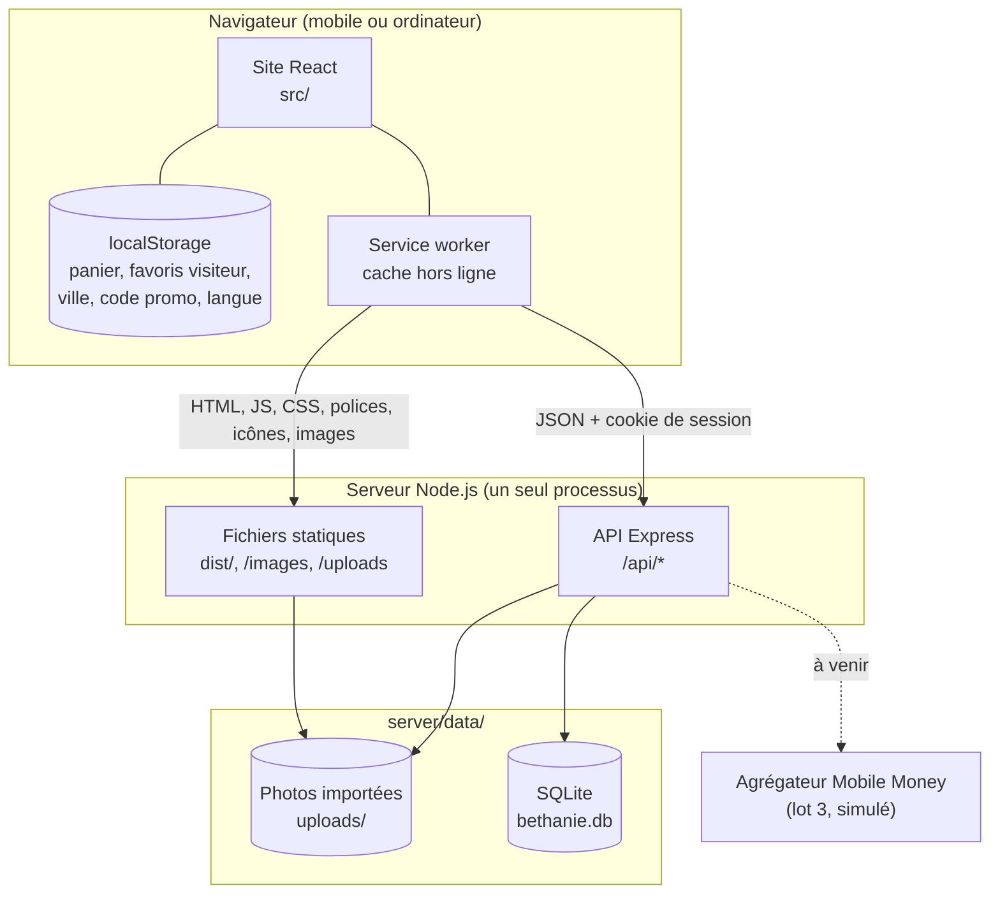

| Couche | Technologies | Rôle |
|---|---|---|
| Interface | React 19, TypeScript, Tailwind CSS 4, Font Awesome 6, polices Poppins et Cinzel (servies par le site) | Écrans, navigation, panier local, traduction FR / EN, animations |
| Application installable | Manifeste web, service worker écrit à la main (`src/pwa/`), généré par un petit plugin Vite | Installation sur l’écran d’accueil, fonctionnement hors ligne, mises à jour |
| Outillage front | Vite 6 | Serveur de développement, build de production |
| API | Node.js ≥ 22.13, Express 5, zod, helmet, express-rate-limit, cookie-parser | Comptes, catalogue, commandes, sécurité |
| Données | `node:sqlite` (SQLite 3.5x intégré à Node) | Persistance, transactions |
| Exécution TypeScript côté serveur | tsx | Lance `server/*.ts` sans étape de compilation |

---

## 2. Environnements

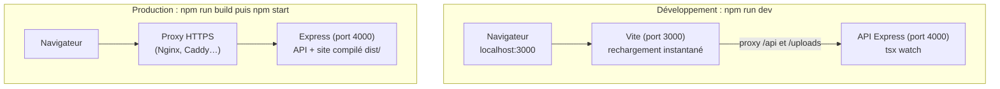

- **Développement** : `npm run dev` lance deux processus via `concurrently`. Vite relaie `/api` et `/uploads`
  vers Express, donc le navigateur ne voit qu’une seule origine (`localhost:3000`) : pas de CORS à gérer.
- **Production** : `npm run build` vérifie les types et compile le site dans `dist/`. `npm start` lance Express,
  qui sert à la fois l’API et `dist/` (même origine, mêmes règles de sécurité). Le HTTPS est assuré par un
  proxy placé devant.
- **Application installable** : le service worker n’existe que dans la version compilée (`npm run build`, qui
  génère `dist/sw.js`) ; il n’est pas enregistré pendant `npm run dev`. Pour tester l’installation et le hors
  ligne : `npm run build` puis `npm start`, et ouvrir `http://localhost:4000` (le navigateur accepte un service
  worker sur `localhost` sans HTTPS ; en ligne, HTTPS est obligatoire).
- Au **premier démarrage**, la base est créée et remplie avec les données de démonstration
  (`server/seed.ts`). `npm run db:reset` supprime la base (serveur arrêté) pour repartir de zéro.

---

## 3. Organisation du code

```
├─ index.html                 page unique : manifeste, préchargement des polices, écran de démarrage animé
├─ vite.config.ts             proxy de développement ; plugin qui génère dist/sw.js
├─ public/
│  ├─ manifest.webmanifest    manifeste de l’application installable (nom, couleurs, icônes, raccourcis)
│  ├─ icons/                  icônes 192 et 512 (normales et « maskable »), icône Apple, favicon
│  ├─ screenshots/            captures montrées par Android dans la fenêtre d’installation
│  ├─ fonts/                  Poppins 400 à 700 et Cinzel 700 (WOFF2, latin et latin étendu)
│  ├─ vendor/fontawesome/     icônes Font Awesome 6.5.2 (CSS et polices WOFF2)
│  └─ images/                 photos de démonstration (+ CREDITS.md)
│     ├─ categories/          illustrations des 8 catégories (<id>.webp)
│     └─ banner/              bannière de l’accueil (texte retiré, affiché en HTML)
├─ src/                       ─── FRONTEND ───
│  ├─ main.tsx                point d’entrée React
│  ├─ index.css               thème : couleurs, polices, motif africain, animations
│  ├─ App.tsx                 navigation, état global, actions, coque (en-têtes, barres d’onglets)
│  ├─ api/client.ts           tous les appels HTTP vers l’API
│  ├─ screens/                un fichier par écran (Accueil, Catégories, Catalogue, Fiche produit,
│  │                          Panier, Paiement, Suivi, Compte, Espace vendeur, Connexion)
│  ├─ components/
│  │  ├─ ui.tsx               briques communes : MobileHeader, QuantityStepper, BottomSheet,
│  │  │                       EmptyState, StatusPill, styles de boutons et de champs
│  │  ├─ Navbar.tsx, Footer.tsx      en-tête et pied de page des écrans larges
│  │  ├─ BottomNav.tsx        barre d’onglets mobile (client et vendeur)
│  │  ├─ LanguageSwitcher.tsx sélecteur FR / EN et drapeaux SVG
│  │  ├─ InstallPrompt.tsx    bannière « Installez Béthanie » et instructions iPhone / iPad
│  │  ├─ ConnectionStatus.tsx pastille « hors connexion » / « connexion rétablie »
│  │  ├─ Onboarding.tsx       démarrage + présentation de la première visite
│  │  ├─ ProductCard.tsx      carte produit unique pour tous les écrans
│  │  ├─ PaymentLogo.tsx      pastilles des moyens de paiement, drapeau du numéro
│  │  └─ BethanieLogo.tsx, Toast.tsx
│  ├─ i18n/                   traduction : fr.ts (référence), en.ts, index.tsx (fournisseur, useI18n)
│  ├─ pwa/
│  │  ├─ pwa.ts               installation, enregistrement et mise à jour du service worker, connexion
│  │  └─ service-worker.js    modèle du service worker (copié dans dist/sw.js à la compilation)
│  ├─ utils/motion.ts         transitions entre écrans (View Transitions), photo partagée carte → fiche
│  ├─ hooks/usePersistentState.ts   état sauvegardé dans le navigateur
│  ├─ utils/commerce.ts       règles métier partagées avec le serveur
│  ├─ data/mockData.ts        catégories (libellés, illustrations) et images de l’accueil
│  └─ types/index.ts          types partagés avec le serveur
├─ server/                    ─── BACKEND ───
│  ├─ index.ts                démarrage : remplissage initial, purge des sessions, écoute
│  ├─ app.ts                  middlewares et montage des routes
│  ├─ config.ts               configuration (variables d’environnement)
│  ├─ db.ts                   connexion SQLite, schéma, transactions
│  ├─ auth.ts                 mots de passe, sessions, garde CSRF
│  ├─ http.ts                 erreurs HTTP, validation, gestionnaire d’erreurs
│  ├─ serializers.ts          lignes SQL → objets au format du frontend
│  ├─ uploads.ts              enregistrement et contrôle des photos
│  ├─ payments.ts             point d’entrée des paiements (simulation)
│  ├─ routes/                 auth.ts, me.ts, catalog.ts, orders.ts
│  ├─ seed.ts, seed-data.ts   données de démonstration
│  ├─ reset.ts                suppression de la base (npm run db:reset)
│  └─ data/                   base + photos importées (créé au démarrage, non versionné)
└─ docs/                      cahier des charges, architecture, maquette de référence (maquette/)
```

Un seul `tsconfig.json` couvre le frontend et le serveur : `npm run build` vérifie les deux.

---

## 4. Frontend

### 4.1 Navigation

L’application n’a qu’une page HTML. Chaque écran a sa propre adresse dans la partie « hash » de l’URL :
le bouton retour du navigateur fonctionne, et une adresse peut être partagée.

| Écran | Adresse | Connexion requise |
|---|---|---|
| Accueil | `#/` | non |
| Catégories | `#/categories` | non |
| Catalogue | `#/catalogue?categorie=mode&boutique=<id>` | non |
| Fiche produit | `#/produit/<id>` | non |
| Panier | `#/panier` | non |
| Paiement | `#/paiement` | **oui** |
| Suivi | `#/suivi/<numéro>` | **oui** |
| Compte | `#/compte/<onglet>` — `orders`, `wishlist`, `addresses`, `payments`, `profile` (vide : menu du profil) | **oui** |
| Espace vendeur | `#/vendeur/<onglet>` — `products`, `orders`, `stats`, `new` (vide : tableau de bord) | **oui** |

`App.tsx` traduit l’adresse en écran (`parseHash` / `buildHash`) ; un onglet inconnu dans l’adresse est ignoré.
Pour un écran protégé sans session, l’écran de connexion s’affiche **à la place**, sans changer d’adresse : une
fois connecté, la personne retrouve directement l’écran demandé (son panier intact). Après un paiement, le
passage au suivi **remplace** l’entrée d’historique pour que « retour » ne ramène pas au formulaire de paiement.

**Flèche « retour » des en-têtes mobiles.** `App.tsx` tient une pile des adresses visitées dans l’application
(`historyRef`, mise à jour à chaque `hashchange`). La flèche appelle `goBack(écranParent)` : s’il existe un écran
précédent dans l’application, elle fait `history.back()` (l’écran d’où l’on vient, avec son défilement) ; sinon
(lien partagé ouvert directement), elle va vers un écran parent logique :

| Écran | Parent si aucun écran précédent |
|---|---|
| Catalogue | Catégories |
| Fiche produit | Catalogue de la catégorie du produit |
| Paiement | Panier |
| Suivi | Compte › Mes commandes |
| Espace vendeur › Ajouter un produit | Tableau de bord vendeur |

### 4.2 Coque de l’application : mobile et ordinateur

La maquette décrit une **application mobile** ; le même code sert aussi les écrans larges. Le point de bascule
est `lg` (1024 px).

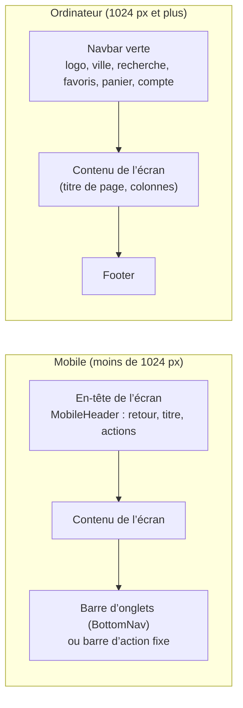

- Chaque écran affiche **son propre en-tête mobile** (`MobileHeader`, masqué sur ordinateur) ; la `Navbar` et
  le `Footer` sont masqués sur mobile.
- La **barre du bas** dépend de l’écran :

| Écran (mobile) | Barre du bas |
|---|---|
| Accueil, Catégories, Catalogue, Panier, Compte, ouverture de boutique | Onglets client : Accueil · Catégories · Panier · Commandes · Profil |
| Espace vendeur (boutique ouverte) | Onglets vendeur : Accueil · Produits · Commandes · Statistiques · Menu (panneau d’actions) |
| Fiche produit | Barre d’achat : panier · Ajouter au panier · Acheter maintenant |
| Paiement | Bouton « Payer … FCFA » |
| Suivi, Ajouter un produit | Aucune (écrans de détail, flèche retour) |

- `App.tsx` ajoute en bas du contenu la hauteur de la barre affichée (plus l’encoche des téléphones,
  `env(safe-area-inset-bottom)`) ; les notifications s’affichent au-dessus.
- Les filtres du catalogue et le menu vendeur s’ouvrent dans un **panneau qui monte du bas** (`BottomSheet`),
  centré sur ordinateur ; il se ferme par la croix, un clic à l’extérieur ou la touche Échap.

**Accueil de première visite** (`Onboarding.tsx`) : écran de démarrage (1,9 s ou toucher), deux écrans de
présentation, puis l’écran « Connectez-vous » avec « Continuer sans compte ». Il ne s’affiche que sur mobile,
une seule fois (`bethanie.onboarded`), et seulement si l’on arrive par l’accueil : un lien partagé vers un
produit s’ouvre directement.

### 4.3 État de l’application

L’état global est volontairement simple : des `useState` dans `App.tsx`, transmis aux écrans par props.
Il n’y a pas de bibliothèque de gestion d’état.

| Donnée | Source | Rafraîchie |
|---|---|---|
| Produits | API (`GET /products`) | au démarrage, après une commande (stocks) |
| Session (`me`) : profil, adresses, paiements, boutique, favoris | API (`GET /auth/me`) | au démarrage, après chaque action sur le compte |
| Commandes du client | API (`GET /orders`) | à la connexion, après paiement ou avancement |
| Commandes du vendeur | API (`GET /seller/orders`) | à l’ouverture de l’espace vendeur et après chaque action |
| Panier | navigateur (`bethanie.cart`) | — |
| Favoris d’un visiteur non connecté | navigateur (`bethanie.wishlist`), fusionnés dans le compte à la connexion | — |
| Ville, code promo choisi | navigateur (`bethanie.city`, `bethanie.promo`) | — |
| Accueil de première visite déjà vu | navigateur (`bethanie.onboarded`) | — |
| Langue de l’interface | navigateur (`bethanie.lang` : `fr` ou `en`) ; à la première visite, langue du navigateur | — |
| Bannière d’installation fermée | navigateur (`bethanie.installDismissedAt`) ; elle réapparaît au bout de 14 jours | — |
| Onglet du compte et de l’espace vendeur | adresse (`#/compte/<onglet>`, `#/vendeur/<onglet>`) | — |

Le panier stocké dans le navigateur est toujours **« réhydraté »** avec les produits de l’API : le prix, le
stock et la photo affichés sont ceux du serveur, et un produit supprimé disparaît du panier.

### 4.4 Client API

`src/api/client.ts` regroupe tous les appels. Chaque requête :

- envoie le cookie de session (même origine) et l’en-tête `X-Bethanie: 1` (protection CSRF, voir §9) ;
- transforme une réponse d’erreur en `ApiError` portant le message français renvoyé par le serveur, que les
  écrans affichent tel quel (formulaires) ou dans une notification.

C’est le **seul point de contact** entre l’interface et le serveur : changer de backend (Firebase par exemple)
ne demanderait de réécrire que ce fichier.

### 4.5 Système de design

Tout le thème est déclaré dans `src/index.css` (Tailwind CSS 4, bloc `@theme`) :

| Élément | Valeur | Usage |
|---|---|---|
| Vert Béthanie | `brand-50` → `brand-900` (`#0F5132`), `brand-dark` | En-têtes, boutons principaux, éléments actifs |
| Or | `gold-50` → `gold-700` (`#E5A93C`) | « Acheter maintenant », « Découvrir », badges, nom de marque |
| Fonds | `surface-light` (`#F8F5EF`, crème), `cream` | Fond des pages, fond des photos |
| Polices | **Poppins** (`font-sans`, `font-display`) : 400 texte, 500 éléments secondaires, 600 boutons et sous-titres, 700 grands titres ; **Cinzel** 700 (`font-brand` : nom « BÉTHANIE ») | Fichiers WOFF2 dans `public/fonts/`, déclarés par `@font-face` dans `index.css` (`font-display: swap`) ; Poppins 400 et 600 et Cinzel préchargées dans `index.html` |
| Ombres | `shadow-soft` (cartes), `shadow-lift` (survol, panneaux), `shadow-glow` (boutons dorés) | Cartes, boutons |
| Motif | `bg-pattern-kente` (losanges dorés en SVG intégré) | Écran de démarrage, bannières, pied de page |
| Icônes | Font Awesome 6 | Partout |

- **Logo** (`BethanieLogo.tsx`) : silhouette de l’Afrique dorée et chariot vert, en SVG ; nom en Cinzel doré ;
  variantes fond clair, fond vert et pictogramme seul. La même forme sert d’icône d’onglet (`index.html`).
- **Bannière de l’accueil** : `public/images/banner/banniere-accueil.webp`, tirée de la bannière fournie
  ([docs/maquette/banniere-accueil-originale.jpg](maquette/banniere-accueil-originale.jpg)) dont le texte et les
  boutons incrustés ont été effacés. Le titre, le texte et les boutons sont affichés par le site, placés dans la
  zone verte de l’image (ordinateur) ou sur un voile vert (mobile) : ils sont traduits et cliquables.
- **Carte produit** : photo, badge, favori, nom, prix et note ; ni ville ni prix barré.
- **Briques communes** (`components/ui.tsx`) : styles de boutons (`btnPrimary`, `btnGold`, `btnOutline`), de
  champs (`inputClass`) et de cartes (`cardClass`), en-tête mobile, sélecteur de quantité, étoiles, pastille de
  statut, état vide, panneau du bas. Les écrans les réutilisent au lieu de recopier leurs classes.
- **Une seule carte produit** (`ProductCard`) pour l’accueil, le catalogue, la fiche produit, le panier et les favoris.
- **Illustrations des catégories** : `public/images/categories/<id>.webp` (320 × 320), découpées dans la planche
  [docs/maquette/illustrations-categories.jpg](maquette/illustrations-categories.jpg). Sur l’accueil, leur fond blanc
  se fond dans le fond crème (`mix-blend-multiply`).
- **Accessibilité** : boutons-icônes étiquetés (`aria-label`), états `aria-current` / `aria-pressed` /
  `aria-expanded`, contour de focus doré visible au clavier, notifications annoncées (`aria-live`), animations
  coupées si le système le demande (`prefers-reduced-motion`).

### 4.6 Langues (français / anglais)

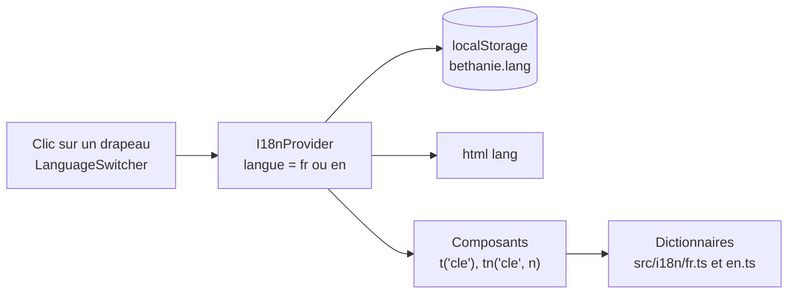

- **Dictionnaires** : `src/i18n/fr.ts` est la référence ; `en.ts` est typé `Record<TranslationKey, string>` :
  une clé oubliée en anglais ou mal orthographiée dans un écran **bloque la compilation**.
- **Fonctions** (`useI18n()`) : `t(clé, paramètres)` avec remplacement des `{paramètres}` ; `tn(clé, n)` pour les
  pluriels (clés `_one` / `_other` ; en français 0 et 1 sont au singulier) ; `rich(clé, éléments)` quand un
  paramètre est un élément React (texte en gras) ; libellés métier `categoryName`, `paymentLabel`,
  `statusLabel`, `stepLabel`, `paymentStatusLabel`, `badgeLabel`, `promoLabel`, `cityLabel`.
- **Sélecteur** (`LanguageSwitcher`, drapeaux dessinés en SVG car les émojis drapeaux ne s’affichent pas sous
  Windows) : en-tête vert sur ordinateur, en-tête de l’accueil mobile, écrans de présentation, écran
  « Connectez-vous », menu du profil.
- **Données venues du serveur** : les identifiants restent en français (statuts `confirmée`…, moyens de paiement
  `Carte bancaire`…, badges `Nouveau`…) et sont traduits à l’affichage. Les étapes du suivi sont affichées
  d’après leur rang dans `ORDER_FLOW`, pas d’après le texte envoyé par le serveur.
- **Non traduit** : contenus saisis par les vendeurs (titres, descriptions, caractéristiques, couleurs), messages
  d’erreur de l’API, dates formatées par le serveur (« 02 oct. 2026 »), heure estimée du livreur (voir L17).

### 4.7 Application installable (PWA) et hors ligne

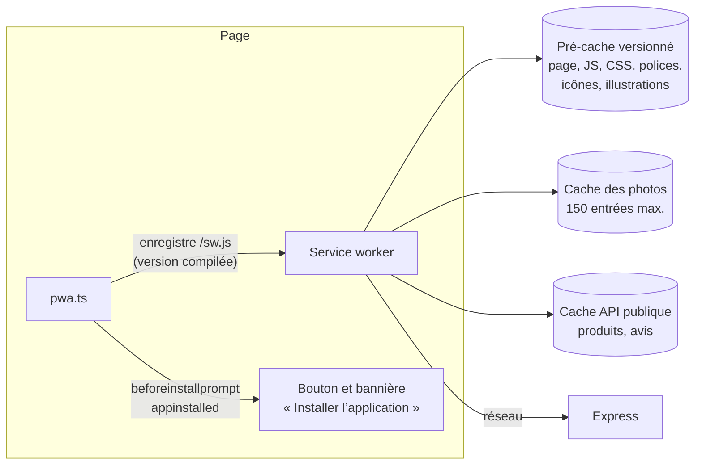

**Manifeste** (`public/manifest.webmanifest`) : nom « Béthanie — Marketplace africaine », nom court « Béthanie »,
mode `standalone`, orientation portrait, couleur principale `#0F5132`, fond `#F8F5EF` (fond de l’écran de
démarrage Android), icônes 192 et 512 « any » et « maskable », raccourcis (panier, catégories, suivi), captures.

**Service worker** (`src/pwa/service-worker.js`, copié dans `dist/sw.js` par le plugin de `vite.config.ts`, qui y
injecte la liste des fichiers compilés et un numéro de version calculé sur leur contenu) :

| Requête | Stratégie | Hors ligne |
|---|---|---|
| Page (navigation) | Réseau d’abord | Page d’accueil en cache (l’application est une page unique) |
| JS, CSS, polices, icônes, illustrations | Pré-cache à l’installation, puis cache d’abord | Disponible |
| Photos (`/images`, `/uploads`) | Cache d’abord, ajoutées à la première consultation | Photos déjà vues |
| `GET /api/products`, `/api/products/:id/reviews`, `/api/config` | Réseau d’abord (4 s maximum), sinon dernière réponse | Catalogue consultable |
| Reste de l’API (compte, panier côté serveur, commandes, paiements) | Réseau uniquement, jamais en cache | Indisponible (message d’erreur) |

**Installation** (`src/pwa/pwa.ts`, importé avant le premier rendu) :
- Android / Chrome / Edge : l’événement `beforeinstallprompt` est intercepté ; le bouton « Installer » (en-tête
  ordinateur), la bannière de l’accueil et la ligne du menu Profil n’apparaissent que s’il a été reçu. Un clic
  ouvre la fenêtre du navigateur ; `appinstalled` masque les boutons et affiche « Application installée ! ».
- iPhone / iPad : Safari n’a pas d’installation automatique ; le même bouton ouvre les instructions (Partager →
  « Sur l’écran d’accueil » → « Ajouter »).
- Rien n’est proposé quand l’application est déjà ouverte en mode installé.

**Mises à jour** : une nouvelle version déployée est installée en arrière-plan ; une notification
« Une nouvelle version de Béthanie est disponible » propose « Mettre à jour », qui active la nouvelle version et
recharge la page. Vérification automatique toutes les heures pour les sessions longues.

**Connexion** : `ConnectionStatus` affiche « Vous êtes actuellement hors connexion » tant que le navigateur
signale l’absence de réseau, puis « Connexion rétablie » pendant 3 secondes.

**Écran de démarrage** : défini dans `index.html` (logo animé, nom en Cinzel, barre de progression), visible avant
même le chargement du JavaScript ; `hideBootSplash()` le retire (fondu) dès que le catalogue est chargé, au plus
tard après 6 secondes. La première visite sur mobile garde en plus l’accueil de présentation (§4.2).

### 4.8 Motion design

Principes : animations courtes (150 à 500 ms), uniquement sur `transform` et `opacity` (calculées par la carte
graphique), jamais bloquantes, coupées si le système demande de réduire les animations
(`prefers-reduced-motion` : CSS, transitions entre écrans et compteurs). Aucune bibliothèque : keyframes et
utilitaires dans `src/index.css`, deux crochets React dans `components/ui.tsx`, fonctions d’animation
(vol vers le panier, inclinaison) dans `utils/motion.ts` avec l’API Web Animations du navigateur.

**À savoir** : « réduire les animations » est un réglage de l’appareil, transmis par le navigateur. Sous Windows, il est activé dès que **Paramètres › Accessibilité › Effets visuels › Effets d’animation** est désactivé (c’est aussi le cas avec « Ajuster afin d’obtenir les meilleures performances ») : Béthanie s’affiche alors sans aucune animation, ce qui est voulu. Sur Android : « Supprimer les animations » ; sur iPhone : « Réduire les animations ».

| Élément | Animation | Où |
|---|---|---|
| Changement d’écran | API View Transitions. Sur mobile, selon le sens : l’écran suivant arrive de la droite, le retour arrive de la gauche, les onglets de la barre du bas passent en fondu (`data-nav-direction` sur `<html>`). Sur ordinateur, fondu et léger glissement vers le haut. La photo de la carte « s’agrandit » vers la fiche produit ; en-tête d’ordinateur et barre d’onglets restent fixes | `App.tsx` (sens déduit de la pile de navigation), `utils/motion.ts`, `index.css` ; glissement CSS équivalent sur les navigateurs sans cette API |
| Bannière d’accueil | La photo se pose (léger zoom arrière), puis défile plus lentement que la page sur mobile (parallaxe par `animation-timeline: view()`, sans JavaScript) ; le titre apparaît mot par mot et les mots en or se soulignent ; reflet doré qui repasse toutes les 5 s sur « Découvrir » | `HomeScreen.tsx` (`HeroTitle`), classes `hero-photo`, `hero-word`, `shine-loop` |
| Ajout au panier | La photo du produit vole en arc jusqu’à l’icône du panier visible (barre d’onglets, barre d’achat de la fiche ou en-tête d’ordinateur), qui rebondit à l’arrivée | `flyToCart` (`utils/motion.ts`), cibles marquées `data-cart-target` |
| Barre d’onglets | Indicateur (trait + pastille derrière l’icône) qui glisse d’un onglet à l’autre avec un léger rebond | `BottomNav.tsx` |
| Cartes produit (ordinateur) | Légère inclinaison 3D qui suit la souris (4 à 5° au plus) et reflet lumineux à l’endroit du pointeur ; rien au toucher | `tiltHandlers` (`utils/motion.ts`), classes `tilt` et `tilt-glare` |
| Paiement accepté | Coche qui se dessine et gerbe de 40 confettis aux couleurs de Béthanie | `CheckoutScreen.tsx`, `Confetti` (`ui.tsx`) |
| Total du panier | Le montant défile vers sa nouvelle valeur quand une quantité change | `CartScreen.tsx` (`CountUp` sans animation à l’ouverture) |
| Sélecteur de l’espace vendeur | Pastille qui glisse entre « Tableau de bord » et « Produits » | `SellerScreen.tsx` |
| Cartes, listes, menus | Apparition en cascade (`stagger`) | Grilles de produits et de catégories, commandes, menus, étapes du suivi |
| Sections de l’accueil | Apparition au défilement (`useReveal`, IntersectionObserver) | Catégories, produits populaires, espace vendeur, engagements |
| Boutons | Enfoncement léger au clic (`scale(0.97)`), ombre au survol, reflet doré sur les boutons or | Règle globale `button:active`, `btnPrimary`, `btnGold` |
| Micro-interactions | Cœur qui « pop » à l’ajout en favori, coche du panier, pastilles de nombre qui rebondissent, cloche qui s’agite (commande en cours), chevrons qui avancent au survol | `ProductCard`, `BottomNav`, `Navbar`, `ui.tsx` |
| Panneaux et fenêtres | Entrée et **sortie** animées (montée du bas sur mobile, zoom sur ordinateur) | `BottomSheet`, fenêtre de paiement |
| Notifications | Entrée, sortie, barre de temps restant | `Toast.tsx` |
| Chiffres | Compteurs qui défilent jusqu’à leur valeur (`CountUp`), barres de statistiques qui se remplissent | Profil, espace vendeur |
| Chargement | Squelettes avec reflet (`skeleton`) au lieu de roues | Catalogue, écrans chargés à la demande, avis |
| Erreurs | Léger tremblement du message | Formulaires (connexion, paiement, profil, produit, code promo) |
| Logo | Le chariot se dessine, les roues apparaissent, halo doré et quelques particules | Écran de démarrage, accueil de première visite |

### 4.9 Performance

- **Écrans chargés à la demande** : Paiement, Suivi, Compte et Espace vendeur sont des fichiers JavaScript séparés
  (`React.lazy`), préchargés pendant les temps morts une fois le catalogue affiché ; le fichier principal passe de
  123 à 114 Ko (compressé) ; 116 Ko avec le motion design renforcé de la version 1.5.
- **Polices et icônes servies par le site** : plus de connexion à Google Fonts ni à cdnjs ; sous-ensembles latin
  et latin étendu uniquement ; trois fichiers préchargés.
- **Images** : chargement différé (`loading="lazy"`, `decoding="async"`), bannière en priorité haute
  (`fetchpriority="high"`), dimensions réservées pour les illustrations.
- **Cache** : fichiers compilés gardés un an (`immutable`, leur nom change à chaque version) ; `index.html`,
  `sw.js` et le manifeste toujours revalidés ; service worker pour les visites suivantes.

---

## 5. Backend

### 5.1 Traitement d’une requête

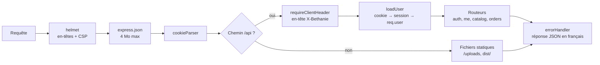

### 5.2 Modules

| Module | Responsabilité |
|---|---|
| `routes/auth.ts` | Inscription, connexion (limitées en fréquence), déconnexion, session courante |
| `routes/me.ts` | Profil, adresses et moyens de paiement (gestion de l’élément « par défaut »), favoris |
| `routes/catalog.ts` | Liste et fiche produits, avis, boutiques, création de boutique, gestion des produits par le vendeur |
| `routes/orders.ts` | Création de commande (recalcul + réservation de stock), paiement simulé, avancement, vue vendeur |
| `serializers.ts` | Construit les objets `Product`, `Order`, `Me`, `Shop`, `Review` attendus par le frontend |
| `payments.ts` | Point d’entrée unique des paiements (aujourd’hui `simulation`) |
| `uploads.ts` | Décodage, vérification du format réel et écriture des photos |

### 5.3 Conventions de l’API

- Préfixe `/api`, corps en JSON, réponses enveloppées : `{ product }`, `{ products, total }`, `{ order }`,
  `{ user }`, `{ reviews }`…
- Erreur : code HTTP adapté et `{ "error": "message en français" }`
  (400 données invalides, 401 non connecté, 403 interdit, 404 introuvable, 409 conflit : stock, doublon…).
- Les routes de `routes/orders.ts` exigent une session ; celles de `/api/me` aussi.
- Validation par schémas zod ; les messages par défaut sont traduits en français (`http.ts`).

| Méthode | Route | Accès |
|---|---|---|
| GET | `/health`, `/config` | public |
| POST | `/auth/register`, `/auth/login`, `/auth/logout` | public |
| GET | `/auth/me` | public (renvoie `user: null` sans session) |
| PATCH | `/me` | connecté |
| POST / DELETE | `/me/addresses`, `/me/addresses/:id`, `/me/addresses/:id/default` | connecté |
| POST / DELETE | `/me/payment-methods`, `/me/payment-methods/:id`, `/me/payment-methods/:id/default` | connecté |
| PUT | `/me/wishlist` | connecté |
| GET | `/products?category=&vendor=&q=&limit=&offset=`, `/products/:id`, `/products/:id/reviews` | public |
| POST | `/products/:id/reviews` | connecté |
| GET | `/shops`, `/shops/:id` | public |
| POST | `/shops` | connecté (une boutique par compte) |
| POST / PATCH / DELETE | `/products`, `/products/:id` | vendeur propriétaire |
| GET / POST | `/orders`, `/orders/:id` | client propriétaire |
| POST | `/orders/:id/pay` | client propriétaire, mode simulation uniquement |
| POST | `/orders/:id/advance` | vendeur concerné, administrateur, ou client en mode démo |
| GET | `/seller/orders` | vendeur |

`POST /products` accepte la photo principale (`imageData`) et jusqu’à deux photos supplémentaires
(`extraImagesData`), toutes en *data URL* ; les photos supplémentaires ne sont prises en compte que si la photo
principale est fournie.

---

## 6. Règles métier partagées

`src/utils/commerce.ts` est importé **à la fois** par le site et par le serveur :

- villes, modes de livraison et calcul des frais (`getDeliveryFee`) ;
- codes promo (`PROMO_CODES`, `findPromo`) ;
- moyens de paiement (`PAYMENT_OPTIONS`) ;
- étapes et libellés des commandes (`ORDER_FLOW`, `nextStatus`, `STATUS_LABELS`) ;
- formats de prix, de date et d’heure (fuseau `Africa/Abidjan`).

Le site s’en sert pour **afficher** une estimation ; le serveur s’en sert pour **décider**. Les montants enregistrés
viennent toujours du serveur, qui relit les prix en base.

---

## 7. Modèle de données

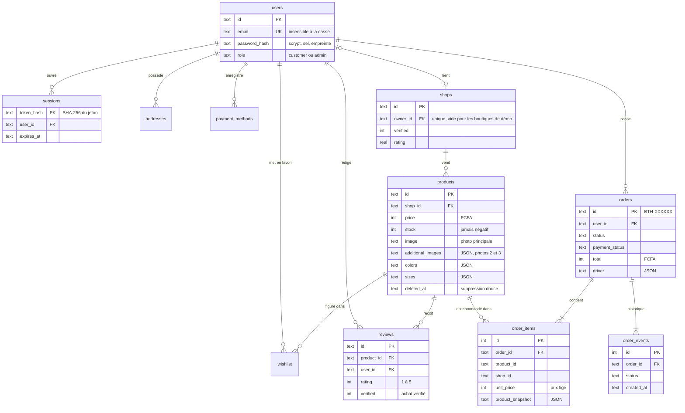

Points notables :

- **Montants en entiers** (FCFA, pas de centimes) : aucun problème d’arrondi.
- **Photo et prix figés** dans `order_items.product_snapshot` et `unit_price` : une commande reste juste même
  si le vendeur modifie ou supprime son produit.
- **Historique** : chaque changement d’étape ajoute une ligne `order_events`, d’où la chronologie horodatée du suivi.
- **Suppression douce** des produits (`deleted_at`) pour préserver l’historique.
- Colonnes JSON (`colors`, `sizes`, `characteristics`, `additional_images`, `driver`) pour les données variables
  qu’on ne filtre pas en SQL.
- Contraintes en base : e-mail unique, un avis par client et par produit, une boutique par compte, stock ≥ 0,
  prix > 0, note entre 1 et 5.
- Le schéma est créé par `server/db.ts` (`CREATE TABLE IF NOT EXISTS`). Il n’y a pas encore d’outil de migration :
  toute modification de schéma sur une base existante devra passer par une migration versionnée (voir §12).

---

## 8. Flux principaux

### 8.1 Connexion

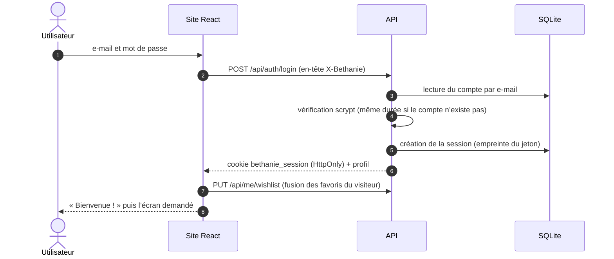

### 8.2 Commande et paiement

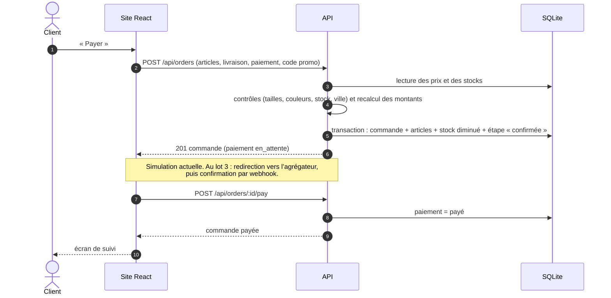

Si un article est épuisé entre-temps, la transaction est annulée en entier et le client reçoit un message
« vient d’être épuisé » (code 409) : aucune commande partielle n’est créée.

### 8.3 Cycle de vie d’une commande

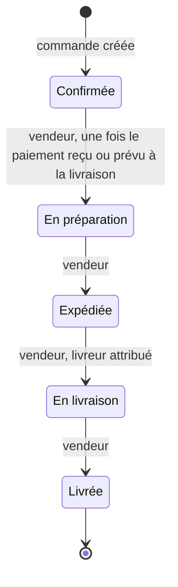

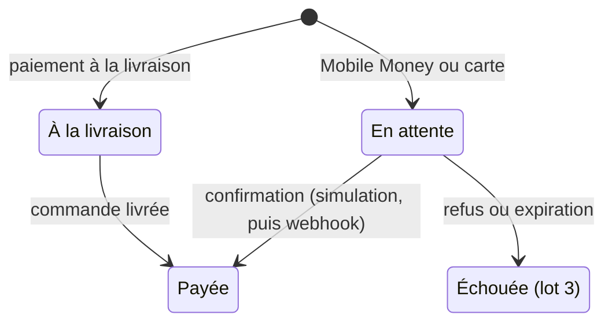

### 8.4 Publication d’un produit avec photos

```mermaid
sequenceDiagram
  autonumber
  actor V as Vendeur
  participant F as Site React
  participant A as API
  participant S as Disque (uploads/)
  participant D as SQLite
  V->>F: choisit jusqu’à 3 photos (la première est la principale)
  F->>F: redimensionne chaque photo (800 px max, JPEG)
  V->>F: « Publier le produit »
  F->>A: POST /api/products (imageData, extraImagesData)
  A->>A: vérifie type, taille (2,5 Mo) et signature réelle de chaque photo
  A->>S: écrit chaque photo sous un nom aléatoire
  A->>D: produit (image = principale, additional_images = autres)
  A-->>F: 201 produit
  F-->>V: onglet « Mes produits » ; la fiche affiche la galerie
```

Sans photo, une image neutre (`/images/placeholder-product.svg`) est utilisée.

---

## 9. Sécurité

| Menace | Parade | Où |
|---|---|---|
| Vol de mot de passe en base | scrypt avec sel aléatoire, comparaison à temps constant | `auth.ts` |
| Découverte des comptes existants | Même message et même temps de réponse si l’e-mail est inconnu | `auth.ts` |
| Vol de session par script (XSS) | Jeton en cookie `HttpOnly`, seule son empreinte est stockée en base | `auth.ts` |
| Requête forgée depuis un autre site (CSRF) | Cookie `SameSite=Lax` + en-tête `X-Bethanie` obligatoire sur toute modification | `auth.ts` |
| Devinette de mots de passe | 20 tentatives par 15 minutes et par IP | `routes/auth.ts` |
| Accès aux données d’autrui | Contrôle du propriétaire sur chaque commande, produit, adresse, moyen de paiement | `routes/*.ts` |
| Prix ou remise manipulés | Recalcul complet côté serveur depuis la base | `routes/orders.ts` |
| Survente | Décrément conditionnel du stock dans une transaction | `routes/orders.ts` |
| Injection SQL | Requêtes paramétrées uniquement | partout |
| Données invalides | Schémas zod avec limites de longueur et de valeur | `routes/*.ts` |
| Fichier piégé | Liste blanche JPEG/PNG/WebP, vérification de la signature, SVG refusé, nom aléatoire | `uploads.ts` |
| Fuite de numéro de carte | Seuls les 4 derniers chiffres sont stockés ; le formulaire carte n’envoie rien au serveur | `routes/me.ts`, `CheckoutScreen.tsx` |
| Injection de contenu | En-têtes helmet, Content-Security-Policy restrictive : scripts, styles, polices, service worker et manifeste limités au site lui-même (plus aucun CDN depuis la v1.3) | `app.ts` |
| Fuite d’informations techniques | Erreurs génériques côté client, détail uniquement dans les journaux du serveur | `http.ts` |

---

## 10. Configuration

| Variable | Défaut | Rôle |
|---|---|---|
| `PORT` | `4000` | Port d’écoute d’Express |
| `DATA_DIR` | `server/data` | Dossier de la base et des photos |
| `DB_PATH` | `<DATA_DIR>/bethanie.db` | Chemin du fichier SQLite |
| `COOKIE_SECURE` | `false` | `true` derrière HTTPS (cookie envoyé uniquement en chiffré) |
| `DEMO_MODE` | `true` | `false` interdit au client de faire avancer lui-même sa commande |
| `PAYMENT_PROVIDER` | `simulation` | Fournisseur de paiement ; toute autre valeur nécessite une implémentation dans `payments.ts` |
| `API_URL` (Vite) | `http://localhost:4000` | Cible du proxy de développement |

Le fichier `.env.local` hérité d’AI Studio (clé Gemini) n’est plus utilisé par l’application.

---

## 11. Décisions d’architecture

| Décision | Pourquoi | Quand la revoir |
|---|---|---|
| **Pas de Firebase pour l’instant** ; API et base hébergées par l’équipe | Demande du porteur de projet ; maîtrise des données et des coûts ; logique métier (stock, prix) côté serveur | Si l’équipe préfère un service géré (voir §13.2) |
| **SQLite intégré à Node** (`node:sqlite`) | Aucun serveur de base à administrer ; aucun module natif à compiler (les scripts d’installation npm sont bloqués sur le poste de développement) ; transactions fiables | Au-delà d’un seul serveur ou d’un fort volume d’écritures simultanées |
| **Sessions en base + cookie HttpOnly** plutôt que JWT | Déconnexion réelle (révocation immédiate), jeton inaccessible au JavaScript | Si plusieurs services doivent valider les sessions |
| **Règles métier dans un fichier partagé** | Une seule définition des frais, promos et statuts pour le site et le serveur | — |
| **Navigation par « hash »** (`#/panier`) | Fonctionne sans configuration du serveur, retour arrière et liens partageables | Pour le référencement (SEO) des fiches produits : passer à des URL classiques avec rendu serveur |
| **État dans `App.tsx`**, sans bibliothèque | Application encore petite, flux de données lisible | Si l’état se complexifie (plusieurs écrans qui partagent du cache) |
| **Panier dans le navigateur** | Permet d’acheter sans compte jusqu’au paiement | Si le panier doit suivre l’utilisateur d’un appareil à l’autre |
| **Un seul processus** sert API et site | Déploiement simple, une seule origine | Si le site passe sur un CDN |
| **Présentation « application mobile » dans le site web** (en-têtes d’écran, barre d’onglets) plutôt qu’une application séparée | Une seule base de code pour mobile et ordinateur ; prépare l’application installable (PWA) du lot 6 | Si une application native devient nécessaire (notifications, mode hors ligne avancé) |
| **Pas de bibliothèque de composants** ; briques maison dans `components/ui.tsx` | Peu de composants, aucun poids ajouté, style exact de la maquette | Si l’interface grossit fortement (formulaires complexes, tableaux d’administration) |
| **Animations en CSS** (+ View Transitions) plutôt que Framer Motion | Environ 40 Ko de JavaScript en moins, animations sur la carte graphique, respect simple de « réduire les animations » | Si des animations pilotées par le geste (glisser, rebond physique) deviennent nécessaires |
| **Service worker écrit à la main** plutôt que Workbox / vite-plugin-pwa | Une centaine de lignes lisibles, aucune dépendance, stratégies adaptées (API publique seulement) | Si les besoins hors ligne se complexifient (synchronisation en arrière-plan, notifications push) |
| **Polices et icônes hébergées par le site** | Fonctionnement hors ligne, chargement plus rapide (pas d’autre domaine), CSP plus stricte | — |

---

## 12. Limites connues et actions avant la mise en production

| # | Limite | Conséquence | Action proposée |
|---|---|---|---|
| L1 | `npm start` utilise `tsx`, installé comme dépendance de développement | Une installation de production sans dépendances de développement (`npm ci --omit=dev`) ne démarre pas | Compiler le serveur en JavaScript (esbuild) ou déplacer `tsx` dans les dépendances |
| L2 | Express ne fait pas confiance au proxy (`trust proxy` non réglé) | Derrière Nginx/Caddy, toutes les requêtes semblent venir de la même IP : la limitation des connexions bloquerait tout le monde | `app.set('trust proxy', 1)` en production |
| L3 | Une commande multi-vendeurs a **un seul statut** | Le premier vendeur qui avance la commande l’avance pour tous | Sous-commandes par vendeur (cahier des charges RG-10) |
| L4 | Les sessions expirées ne sont purgées qu’au démarrage | La table `sessions` grossit si le serveur tourne longtemps | Purge périodique (par exemple toutes les heures) |
| L5 | Limitation des tentatives stockée en mémoire | Remise à zéro au redémarrage ; non partagée entre plusieurs serveurs | Stockage partagé si plusieurs instances |
| L6 | Pas d’outil de migration de schéma | Modifier une table d’une base existante est manuel | Migrations numérotées (`PRAGMA user_version`) |
| L7 | Le site charge jusqu’à 500 produits d’un coup | Lenteur quand le catalogue grandira | Pagination et filtres côté serveur (l’API les accepte déjà) |
| L8 | Codes promo et livreurs écrits dans le code | Pas de gestion sans développeur | Tables dédiées + espace administrateur |
| L9 | Notes et nombres d’avis des produits de démo repris de la maquette | Un produit annonce « 124 avis » mais n’en a que 3 en base | Sans objet en production (données réelles) |
| L10 | Photos sur le disque local | À inclure dans les sauvegardes ; non partagées entre serveurs | Stockage objet (S3 ou équivalent) si plusieurs serveurs |
| L11 | Aucun test automatisé dans le dépôt | Régressions possibles | Tests d’API (`node:test`) et parcours d’achat (Playwright) en intégration continue |
| L12 | Paiement simulé | Aucun encaissement réel | Lot 3 : agrégateur + webhook signé ; supprimer `/orders/:id/pay` |
| L13 | Connexion Google et par téléphone de la maquette non branchées | Le bouton Google est affiché désactivé (« Bientôt ») ; « Continuer avec téléphone » est remplacé par « Continuer avec e-mail », car un numéro n’identifie pas un compte de façon unique | Lot 3 : fournisseur OAuth Google ; connexion par code SMS (OTP) avec numéro unique et vérifié |
| L14 | Illustrations des catégories en 320 × 320 px (découpées dans la planche fournie) | Légèrement floues sur écran haute densité en grand format | Fournir chaque illustration séparément, en 640 px ou en SVG |
| L15 | Photos des écrans de présentation et de l’encart « Espace vendeur » provisoires (marché, atelier) | Ne correspondent pas exactement à la maquette | Photos officielles de Béthanie (voir `public/images/CREDITS.md`) |
| L16 | La cloche de l’accueil mène au suivi des commandes | Pas de centre de notifications | Lot 3 : notifications (CMD-09) |
| L17 | Traduction limitée à l’interface | En anglais, les messages d’erreur de l’API, les dates des commandes et les fiches produit restent en français | API : renvoyer des codes d’erreur et des dates ISO, traduits par le site ; fiches produit : champs bilingues ou traduction proposée au vendeur (décision D12) |
| L18 | Hors ligne : consultation seulement | Connexion, paiement, suivi des commandes et espace vendeur demandent le réseau ; le panier reste utilisable (stocké dans le navigateur) | Lot 6 : file d’attente des actions hors ligne si nécessaire |
| L19 | La pastille « hors connexion » suit l’état réseau annoncé par le navigateur | Un réseau présent mais sans accès au serveur n’est pas signalé comme « hors connexion » (les erreurs s’affichent normalement) | Sonder `/api/health` en cas d’échecs répétés |
| L20 | Installation sur iPhone / iPad manuelle | Safari ne propose pas de bouton d’installation ; on affiche les instructions | Limite d’Apple |
| L21 | Font Awesome complet (≈ 180 Ko pour les polices pleines et régulières) | Poids au premier chargement (ensuite en cache) | Sous-ensemble limité aux icônes utilisées, ou icônes SVG |

---

## 13. Évolutions possibles

### 13.1 Montée en charge

1. Régler L1, L2 et L4, puis mettre en place les sauvegardes (copie du fichier SQLite à chaud via
   `VACUUM INTO`, plus le dossier `uploads/`).
2. Si le trafic l’exige : PostgreSQL à la place de SQLite (les requêtes sont en SQL standard, regroupées dans
   `server/`), photos sur un stockage objet, plusieurs instances derrière un répartiteur de charge.

### 13.2 Passage éventuel à Firebase

Firebase a été écarté « pour l’instant ». Si ce choix change, la correspondance serait :

| Aujourd’hui | Avec Firebase |
|---|---|
| `routes/auth.ts`, sessions | Firebase Authentication (e-mail, téléphone par SMS) |
| Tables SQLite | Collections Firestore |
| Création de commande, stock, avancement | Cloud Functions (cette logique doit rester côté serveur) |
| `server/data/uploads/` | Cloud Storage |
| `src/utils/commerce.ts` | Inchangé, partagé avec les Cloud Functions |
| `src/api/client.ts` | Réécrit pour appeler Firebase ; les écrans ne changent pas |
